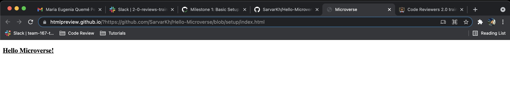

# Hello Microverse

> This project was created as part of the Code Reviewers training job application at Microverse.org

## Built With

- HTML/CSS

## Live Demo

[Live Demo Link](https://htmlpreview.github.io/?https://github.com/SarvarKh/Hello-Microverse/blob/setup/index.html)

## Getting Started
To get a local copy up and running follow these simple example steps.

    Step 1: git clone https://github.com/SarvarKh/to-do-list.git
    
    Step 2: open live-server

## Authors

👤 **Sarvar Khalimov**

- GitHub: [@SarvarKh](https://github.com/SarvarKh)
- Twitter: [@KhalimovSarvar](https://twitter.com/KhalimovSarvar)
- LinkedIn: [LinkedIn](https://www.linkedin.com/in/sarvar-khalimov)

## 🤝 Contributing

Contributions, issues, and feature requests are welcome!

Feel free to check the [issues page](../../issues/).

## Show your support

Give a ⭐️ if you like this project!

## Acknowledgments

- Hat tip to anyone whose code was used
- Inspiration
- etc

## 📝 License

This project is [MIT](./MIT.md) licensed.